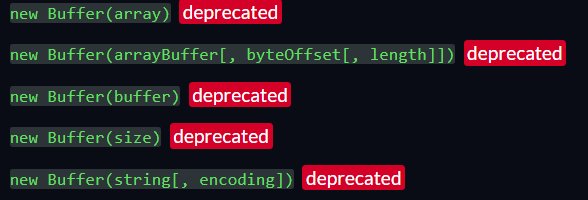

# Challenge

## Question 1
What is the flag?

---

# Analysis 

---

## Determine Normal Usage
Allows users to add and delete items to a grocery list.

---

## Web App Exploit Checklist (for NCL but these are good to check in any web app exploit test)
This checklist is a good start to solving the easy and medium challenges.
- [ ] Robots.txt
- [ ] Sitemap.xml
- [ ] Cookies
- [ ] Vulnerable Javascript code

---

### NOTHING TO EXPLOIT???
Well no cause we're here.

---

### What To Do Next?
If we can't find anything built in, let's look at what happens in the network when we use the web app.

Using the dev console, we can look at the network tab and see that whenever we add an item, it sends a POST request to `/add` and contains a unique payload. 

---

#### Payload
```
[
  {
    "type": "Buffer",
    "data": [
      98,
      97,
      99,
      111,
      110
    ]
  }
]
```
---

#### Examining the Payload (Values)
Inside the payload, we see that the data is a Buffer with a series of numbers. Testing multiple values shows that the number of characters in our input = number of numbers in the payload. (My input was "bacon")

---

#### Examining the Payload (Buffer)
We also see Buffer is used. Just Googling "Buffer payload" gives a lot of results that say "`NodeJS Buffer`". (The headers can also show you it's powered by Express which is built off NodeJS) Looking at the documentation for the Buffer class, we can see it has a lot of deprecated methods. 

---

#### Examining Buffer

We can see a lot of different methods in here that may be vulnerable to attack.

---

# Exploiting
Now we can move onto the real exploit by looking at all the information we have determined.

---


## Information
- We send payloads of Buffer type to add data to the grocery list
- Buffer class has a lot of deprecated methods

---

## Using the Information
The best thing to do is to attempt to send modified requests using these deprecated methods. For example, what would happen if we send the a numeric payload instead of a string?
```
Highly recommend using a tool like Burp Suite, ZAP, Postman, or the curl command.
```

---

## Result
Sending a numeric payload (`10`) results in part of the flag being revealed. So what happens if we increase this number since this seemed to reveal something?

Sending a numeric payload (`1000`) results in the entire flag being revealed.
