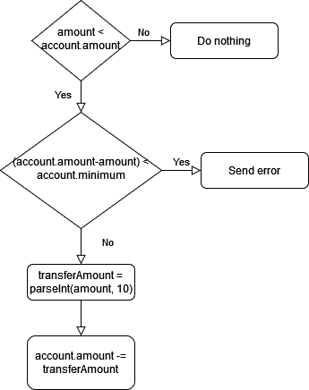

# Challenge

## Question 1
What is the path of the leaked file?

## Question 2
What is the flag?

# Analysis 
## Determine Normal Usage
This is a login portal. When giving random credentials, it informs that the credentials are incorrect.

## Web App Exploit Checklist (for NCL but these are good to check in any web app exploit test)
- [X] Robots.txt
- [ ] Sitemap.xml
- [ ] Cookies
- [X] Javascript code

### Robots.txt
Navigating to `/robots.txt` will show the following page is hidden from bots: `/dev/rel.js`.

Navigating to this page shows what looks to be Javascript code and skimming it suggests that this is the backend code!

### Javascript
#### Source
1. The function `transfer()` will take the value of the amount put into the `#transferAmt` input field and set the `amount` variable to this value
2. Agent will send a post request to `/transfer`
   - Sends the `amount`
   - Sends the `account` which is set to 'ForgeOfNeverWinter'
3. Then reloads the page

#### /dev/rel.js

Seems like standard code until you look further at what it is doing. **PAY ATTENTION TO THE FUNCTION IT CALLS.**

This is using parseInt and we see it is used twice in two different ways:
- Twice with 1 parameter
- Once with 2 parameters

This is also the only function used on the backend that modifies the input that we are giving.

[Looking up how this function is used](https://developer.mozilla.org/en-US/docs/Web/JavaScript/Reference/Global_Objects/parseInt) shows that this function parses a string and returns an integer of the specified radix. The modern default is radix 10. 

[Looking further into this function](https://www.w3schools.com/jsref_parseint.asp#:~:text=If%20the%20string%20begins%20with,the%20radix%20is%2010%20(decimal)) will show that this was not always the case and that older versions use radix 8 as the default. 

# Exploiting
Now we can move onto the real exploit by looking at all the information we have determined.
## Information
- We are running a pentest on "**this bank's old out of date system**"
- We can't transfer money out of the Forge account if it leaves it with <10
- The function used in the backend Javascript takes our input and uses a function that used to default to radix 8 in string->int conversion

## Using the Information
This system is out dated, can we attempt to use that outdated function to remove more than 1000? The default radix is 8 so what happens if we enter a large number in radix 8 (starting with 0) and remove the remaining amount? (If reset = 01000)

## Result
Our money is set to 1000 and the flag is output below it.
